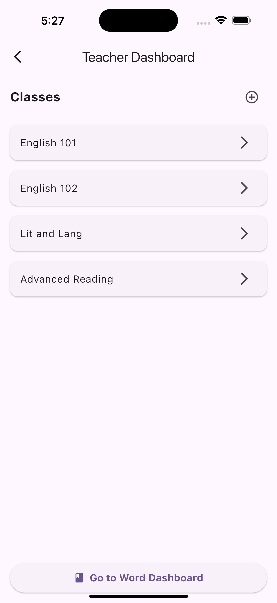

# 📘 ReadRight Prototype  
## Milestone 0 — Initial Prototype Overview

The **ReadRight** prototype is a dual-role educational platform designed for **teachers** and **students**.  
In its current state, it simulates login, registration, classroom management, and word-pronunciation practice.

> ⚠️ Current functionality is largely static and non-persistent.  
> It serves as a skeleton for future integration with services such as **Firebase** for authentication and data storage.

---

## 🚀 Application Flow
> Please refer to the [Mobile Screens](#mobile-screens) section below to see the actual interface.

### 🏠 Landing Page
A visually engaging startup screen that introduces the ReadRight app before navigating to role selection.

**landing_screen**
> The landing screen serves as an entry, loading screen to the ReadRight app. It serves as a visually appealing startup screen before navigating to the reader_selection_screen.

### 👥 Role Selection
Users identify as either **Teacher** or **Student**, determining which side of the app (portal) they will enter.

**reader_selection_screen**
>The reader selection screen presents a role selection where users identify themselves as either instructors or students. These are the only two operations for this screen, but they carry larger implications as to what side of the app the user will enter, i.e., the instructor portal for instructors or the learning portal for students. 

---

## 👩‍🏫 Teacher Experience

### 🔑 Login / Register / Reset Screens
- **teacher_login_screen.dart** — Teachers sign in with email + password.  
  - “Forgot Password” → Password Reset  
  - “Create Account” → Registration  
  - Mimics Firebase OAuth flow for future functionality.

>This is the Teacher Login screen that allows a teacher to sign into their account using their email and password. The Sign-In button will route to the Teacher Dashboard (given a successful login). If the user cannot remember their password, a forgot password option will be available that will route them to the Password Reset screen. If the user does not have an account, they can select the Create Account link which will direct them to the teacher register screen. These options were created to mimic the functionality that Firebase or other frameworks will provide further in development. This will allow us to have OAuth and provide actual security.

- **teacher_password_reset_screen.dart** — Prototype flow for password recovery via email.

> This screen will serve as the way a teacher can reset their password. Eventually, this will be replaced by a different framework like Firebase but for now this is the prototype to mimic the eventual functionality. The user will provide their email in the input field and submit it to begin the reset process. Once submit is hit, in the future, the user will be able to receive an email to reset the password and the user in the app is directed back to the login screen.

- **teacher_register_screen.dart** — Prototype account creation form; future integration will persist data with Firebase.

> This is where the user will be able to create an account. Again this is temporary and will be replaced by a framework such as Firebase. The user will be prompted to enter a set of information to set up their account. When they are done, they press submit. Once submit is pressed the user account will be created (future functionality) and they will be redirected to the login screen. If the user is at this screen and they already have an account, they may select the Sign in option which will direct them to the Sign in page.

---

### 🧭 Teacher Dashboard
  
  Acts as the **home base** for teachers.
  - View / add / delete classes  
  - Access the **Class Dashboard** or **Word Dashboard**  
  - Current data is static and for display only.

**teacher_dashboard_screen.dart**
> The teacher dashboard is the “Home base” for the teacher app. Here they will be shown the Classes they currently have created. They will be able to add/delete their classes as well as click on each class to go to the Class Dashboard Page. If the user wants to add/modify/remove/view the words in the database for their account, they can select the Go to Word Dashboard button. This screen serves as a way to display or connect the teacher to everything under their account. *Note* Current Data is for display purposes only

---

### 🏫 Class Dashboard

Displays details about a specific class:
  - **Students Tab** — list of enrolled students, search + filter, progress overview, click → details  
  - **Words Tab** — view / select / filter words available to the class  
  - **➕ Icon** — link to the Word Dashboard  
  > *Note:* All data currently non-persistent.

**class_dashboard_screen.dart**
>The Class Dashboard screen will provide further information about each class concerning the Students enrolled, and the words tied to that class. The Students tab shows a list of the enrolled students and the progress completed with the words tied to the class. This list can be filtered or searched to find the given student. Students can be added or removed from the list and student information can be accessed by clicking the student card. This will route the user to the Class Student Details screen. Under the Words tab, this shows a list of all of the words in the database in a card. The card contains a checkbox which allows the user to select which words they want the class to have access to. Like the Student list it can be filtered. If the user wants to edit the overall database of words, they can be redirected to the Word Dashboard using the + icon. *Note* Current Data is for display purposes only.

---

### 👤 Student Details (Teacher View)

  - Shows progress, enrollment info, and words the student struggles with.  
  - Toggle for **Audio Retention** (simulation only).

**class_student_details_screen.dart** 
>This screen contains further information about the selected student. Here the user can see the progress the student has made along with some additional information such as top words they struggled with, the classes they are enrolled in, etc. The user can also select a checkbox to enable/disable Audio retention. *Note* Current Data is for display purposes only.

---

### 🗂️ Word Dashboard

  Teachers can:
  - Add new words or CSV files  
  - Toggle, edit, delete entries  
  - View word details (category + example sentences)  
  > Data read from [`data/seed_words.csv`;](../../data/seed_words.csv) changes are not saved.

**teacher_word_dashboard_screen**
>This screen contains the full word list available to a teacher. The teacher then has the option to add a new word or CSV file, toggle on or off words, delete words from the list, edit existing words, and view the details of each word, i.e., the word category and example sentences by clicking on the word in the list. *Note* data is read from the default seed_worlds.csv file (data/seed_words.csv) and any additions, modifications, or deletions will not be saved at this time. 

---

## 👩‍🎓 Student Experience

### 🔑 Login & Class Verification
- **student_login_screen.dart** — Students enter their email to receive a class code.  
- **student_passcode_verification_screen.dart** — Students input the 6-digit One-Time Passcode (OTP) code to join their class.

**student_login_screen**
>This screen provides a means for students to access the app and identify their classroom. A simple email text field requires an email through which a class code may be sent, and the student may join a classroom via the student_passcode_verification_screen. 

**student_passcode_verification_screen**
>>This screen allows students to enter their 6-digit class code they received via email so that they may be added to their classroom and begin learning. An One-Time Passcode (OTP) text field is used to collect the passcode in a visually appealing and PG manner. 

---

### 📊 Word Dashboard
- **student_word_dashboard_screen.dart**  
  Displays a student’s assigned words and completion progress.  
  - Filter by word type  
  - Click a word to practice  
  > *Static example only.*

**student_word_dashboard_screen**
>The student word dashboard screen displays an individual student’s progress for their assigned list of words. Each student may view a personalized dashboard with completed and remaining words, with the ability to filter by word type and/or practice a word by clicking on it. *Note* this is a static example, so filters and progress are simulated. 

---

### 🗣️ Word Practice
- **student_word_practice_screen.dart**  
  Practice pronunciation of selected words with:
  - Word + example sentence  
  - Friendly illustration for engagement  
  - Record + grade attempt (simulated)  
  - Recording progress indicator

**student_word_practice_screen**
>This screen allows a student to practice pronouncing whichever word they chose from the student_word_dashboard_screen. A friendly illustration is included to make the screen feel friendly and engaging. The word is accompanied by an example sentence, and the student has the ability to record their attempt so it can then be graded. A recording progress indicator is given to notify the user that their attempt is in progress. *Note* this is a proof of concept and is not meant to be a dynamic, final product. 

---

## 🧾 Data Source: [`data/seed_words.csv`;](../../data/seed_words.csv)

A structured word list for early reading and pronunciation practice. Words are categorized according to popular word lists (e.g., Dolch, Phonics, Minimal Pairs).

| Word | Category | Sentence 1 | Sentence 2 | Sentence 3 |
|------|-----------|------------|------------|------------|
| away | Sight Words | Please go away from the wet paint. | The bird flew away into the sky. | Don’t throw your toys away; put them in the box. |
| cat  | Phonics patterns | The cat is sleeping on the bed. |	I see a black cat outside. |	My cat likes to chase a ball of yarn. |

---

## 👩‍💻 Contributors
| Name | Email |
|------|--------|
| **Zachary Trabookis** | <ztraboo@clemson.edu> |
| **Jonathan Gilreath** | <jhgilre@g.clemson.edu> |
| **Noah Carter** | <ncarte4@clemson.edu> |

---

## 📱 Mobile Screens

### Landing and Onboarding
The following screens showcase the onboarding steps for the application:

| Landing | Role Selection |
|:--:|:--:|
|  |  |

### Teacher Flow
The following screens showcase teacher interfaces for the application:

| Login | Password Reset | Registration |
|:--:|:--:|:--:|
|  |  |  |

| Class Dashboard | Class Progress | Class Word List |
|:--:|:--:|:--:|
|  |  |  |

| Student Details | Word Dashboard |
|:--:|:--:|
|  |  |

### Student Flow
The following screens showcase student interfaces for the application:

| Login | Password Verification |
|:--:|:--:|
|  |  |

| Word Practice List | Word Practice | 
|:--:|:--:|
|  |  |

| Word Feedback (Happy) | Word Feedback (Sad) |
|:--:|:--:|
|  |  |

---

© 2025 ReadRight Team — Clemson University - CPSC 6150
