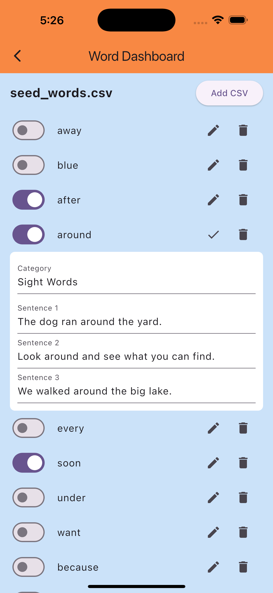
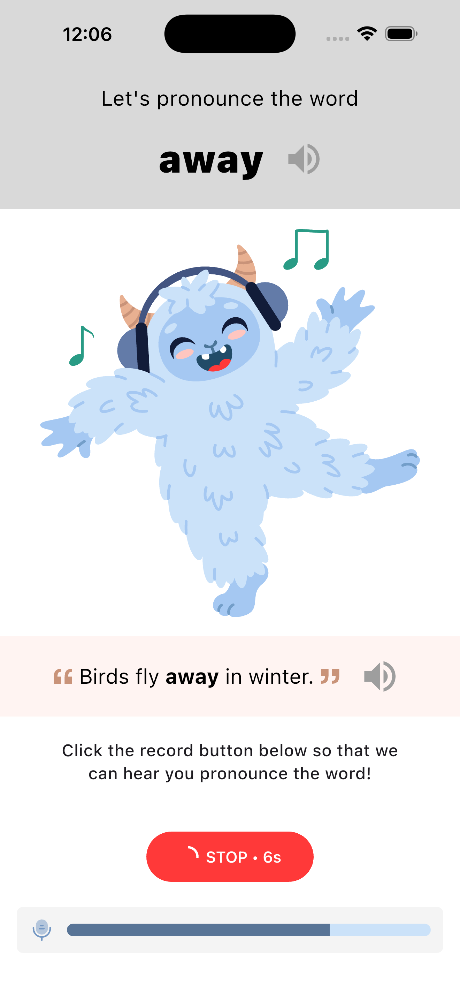
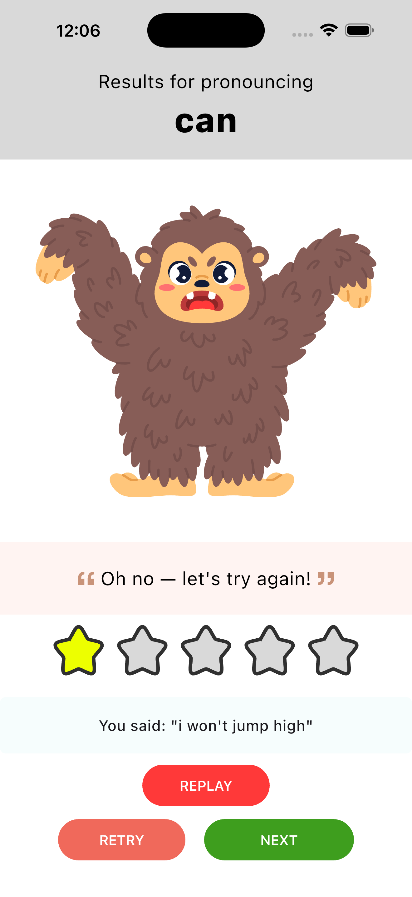

# 📘 ReadRight Prototype  
## Milestone 1 — Foundation & Vertical Slice (MVP)

The **ReadRight** prototype is a dual-role educational platform designed for **teachers** and **students**.  
In its current state, it simulates login, registration, classroom management, and word-pronunciation practice.

> ⚠️ Current functionality is largely static and non-persistent.  
> It serves as a skeleton for future integration with services such as **Firebase** for authentication and data storage.

---

## 🚀 Application Flow
> Please refer to the [Mobile Screens](#mobile-screens) section below to see the actual interface.

### 🏠 Landing Page
A visually engaging startup screen that introduces the ReadRight app before navigating to role selection.

**landing_screen**
> The landing screen serves as an entry, loading screen to the ReadRight app. It serves as a visually appealing startup screen before navigating to the reader_selection_screen.

### 👥 Role Selection
Users identify as either **Teacher** or **Student**, determining which side of the app (portal) they will enter.

**reader_selection_screen**
>The reader selection screen presents a role selection where users identify themselves as either instructors or students. These are the only two operations for this screen, but they carry larger implications as to what side of the app the user will enter, i.e., the instructor portal for instructors or the learning portal for students. 

---

## 👩‍🏫 Teacher Experience

### 🔑 Login / Register / Reset Screens
- **teacher_login_screen.dart** — Teachers sign in with email + password.  
  - “Forgot Password” → Password Reset  
  - “Create Account” → Registration  
  - Mimics Firebase OAuth flow for future functionality.

>This is the Teacher Login screen that allows a teacher to sign into their account using their email and password. The Sign-In button will route to the Teacher Dashboard (given a successful login). If the user cannot remember their password, a forgot password option will be available that will route them to the Password Reset screen. If the user does not have an account, they can select the Create Account link which will direct them to the teacher register screen. These options were created to mimic the functionality that Firebase or other frameworks will provide further in development. This will allow us to have OAuth and provide actual security.

- **teacher_password_reset_screen.dart** — Prototype flow for password recovery via email.

> This screen will serve as the way a teacher can reset their password. Eventually, this will be replaced by a different framework like Firebase but for now this is the prototype to mimic the eventual functionality. The user will provide their email in the input field and submit it to begin the reset process. Once submit is hit, in the future, the user will be able to receive an email to reset the password and the user in the app is directed back to the login screen.

- **teacher_register_screen.dart** — Prototype account creation form; future integration will persist data with Firebase.

> This is where the user will be able to create an account. Again this is temporary and will be replaced by a framework such as Firebase. The user will be prompted to enter a set of information to set up their account. When they are done, they press submit. Once submit is pressed the user account will be created (future functionality) and they will be redirected to the login screen. If the user is at this screen and they already have an account, they may select the Sign in option which will direct them to the Sign in page.

### Update Milestone 2
- **teacher_register_screen.dart** —
When a teacher registers for an account creation, they are prompted to enter in their fullname, institution, username, email, and password. This milestone, the teacher account registration was enhanced to create a teacher and assign the teacher to a classroom in Firebase. Upon the creation of the classroom, the class progress is defaulted to empty/0 and there are no students associated to the class. The class code for the newly created class gets assigned from the first 6 characters of the firebase Class document code (class uid) . This is currently set to be the password for any students created in the teacher dashboard. 
---

### 🧭 Teacher Dashboard

  Acts as the **home base** for teachers.
  - Students Tab — list of enrolled students, search + filter, progress overview, click → details
    -   Search Students - Type in this field to search for student
    -   Person➕ Icon -- Add/register a student to the dashboard
    -   Sort Icon --- Sort by name (A-Z, Z-A) or completetion status (High - Low, Low - High)
  - Word Dashboard Button — link to the Word Dashboard
  - Class Details --- Provides an overview of Class information/statistics
  - Access the Student Details or Word Dashboard

**teacher_dashboard_screen.dart**

> The teacher dashboard is the “Home base” for the teacher app. Here they will be shown the Classes they currently have created. They will be able to add/delete their classes as well as click on each class to go to the Class Dashboard Page. If the user wants to add/modify/remove/view the words in the database for their account, they can select the Go to Word Dashboard button. This screen serves as a way to display or connect the teacher to everything under their account. *Note* Current Data is for display purposes only

#### Update: Milestone 1

This screen is used as the central hub for the teachers so that they may do the following:
- Access the Word Dashboard through the Word Dashboard button
- See all the student registered to their class on the Students Tab
- View a quick completion progress for each student shown through the progress bar under their names.
- Access the class_student_details_screen by selecting the student to check on the individual student progress.
- View progress at a class level or extra class details in the Class Details Tab.
  - Teacher
  - Class Code
  - Total Amount of Words Assigned
  - Class Average
  - Top Struggled Words

Currently we are referencing test data that we created from firebase/firestore. This will be updated to match the data with whoever is logged in and their specific class/student information.

### Update: Milestone 2

Added functionality to the following:
- Search Students: Type in this field to search for student
  - The teacher can type out a student's name and the list will filter based on the characters entered
-   ➕ Icon - Add/register a student to the dashboard
  - Here the teacher can add/register a student to the class
    - When this button is pressed, a pop-up dialog appears prompting the teacher to Add a student.
    - The Teacher will need to add the Student's Fullname, the email, and the username.
    - Pressing Create do the following:
    - Create a new Student User
    - Create a new Student profile where progress is stored. Items are set to empty/0 since this is a new profile
    - The student is added the classroom
    - The student password is set to the class code
    - Return the teacher to the dashboard and update the student list to include the new added student
    - Pressing the Cancel button will return the teacher back to the teacher dashboard and NOT create a student
- Sort Icon - Sort student by name (A-Z, Z-A) or completetion status (High - Low, Low - High). The list will update when the selection is pressed.

### 🏫 Class Dashboard  (Deprecated)

**class_dashboard_screen.dart**
>The Class Dashboard screen will provide further information about each class concerning the Students enrolled, and the words tied to that class. The Students tab shows a list of the enrolled students and the progress completed with the words tied to the class. This list can be filtered or searched to find the given student. Students can be added or removed from the list and student information can be accessed by clicking the student card. This will route the user to the Class Student Details screen. Under the Words tab, this shows a list of all of the words in the database in a card. The card contains a checkbox which allows the user to select which words they want the class to have access to. Like the Student list it can be filtered. If the user wants to edit the overall database of words, they can be redirected to the Word Dashboard using the + icon. *Note* Current Data is for display purposes only.
>
>#### Update: Milestone 1
This is being phased out due to time constraints and direction from the customer. Instead of managing multiple classes, the app will just focus on one class per teacher. We can bring this back in a future update if needed. The **Teacher Dashboard** will now be the primary landing page after the teacher logs in successfully.

---

### 👤 Student Details (Teacher View)

  - Shows progress, enrollment info, and words the student struggles with.  
  - Toggle for **Audio Retention** (simulation only).

**class_student_details_screen.dart** 
>This screen contains further information about the selected student. Here the user can see the progress the student has made along with some additional information such as top words they struggled with, the classes they are enrolled in, etc. The user can also select a checkbox to enable/disable Audio retention. *Note* Current Data is for display purposes only.

#### Update: Milestone 1

This screen is used to display the progress of the given student as well as student options. The screen currently displays the following:
- Progress Bar - showing the among of words completed out of the given class set
- Student Average
- Total Attempts
- Top Struggled Words
- Option to Toggle Audio Retention

Currently we are referencing test data that we created from firebase/firestore. This will be updated to match the data with whoever is logged in and their specific class/student information.

---

### 🗂️ Word Dashboard

  Teachers can:
  - Add new words or CSV files  
  - Toggle, edit, delete entries  
  - View word details (category + example sentences)  
  > Data read from [`data/seed_words.csv`;](../../data/seed_words.csv) changes are not saved.

**teacher_word_dashboard_screen**
>This screen contains the full word list available to a teacher. The teacher then has the option to add a new word or CSV file, toggle on or off words, delete words from the list, edit existing words, and view the details of each word, i.e., the word category and example sentences by clicking on the word in the list. *Note* data is read from the default seed_worlds.csv file (data/seed_words.csv) and any additions, modifications, or deletions will not be saved at this time. 

---

## 👩‍🎓 Student Experience

### 🔑 Login & Class Verification
- **student_login_screen.dart** — Students enter their email to receive a class code.  
- **student_passcode_verification_screen.dart** — Students input the 6-digit One-Time Passcode (OTP) code to join their class.

**student_login_screen**
>This screen provides a means for students to access the app and identify their classroom. A simple email text field requires an email through which a class code may be sent, and the student may join a classroom via the student_passcode_verification_screen. 

**student_passcode_verification_screen**
>>This screen allows students to enter their 6-digit class code they received via email so that they may be added to their classroom and begin learning. An One-Time Passcode (OTP) text field is used to collect the passcode in a visually appealing and PG manner. 

---

### 📊 Word Dashboard
- **student_word_dashboard_screen.dart**  
  Displays a student’s assigned words and completion progress.  
  - Filter by word type  
  - Click a word to practice  
  > *Static example only.*

**student_word_dashboard_screen**
>The student word dashboard screen displays an individual student’s progress for their assigned list of words. Each student may view a personalized dashboard with completed and remaining words, with the ability to filter by word type and/or practice a word by clicking on it. *Note* this is a static example, so filters and progress are simulated. 

---

### 🗣️ Word Practice
- **student_word_practice_screen.dart**  
  Practice pronunciation of selected words with:
  - Word + example sentence  
  - Friendly illustration for engagement  
  - Record + grade attempt (simulated)  
  - Recording progress indicator

**student_word_practice_screen**
>This screen allows a student to practice pronouncing whichever word they chose from the student_word_dashboard_screen. A friendly illustration is included to make the screen feel friendly and engaging. The word is accompanied by an example sentence, and the student has the ability to record their attempt so it can then be graded. A recording progress indicator is given to notify the user that their attempt is in progress. *Note* this is a proof of concept and is not meant to be a dynamic, final product. 

---

## 🧾 Data Source: [`data/seed_words.csv`;](../../data/seed_words.csv)

A structured word list for early reading and pronunciation practice. Words are categorized according to popular word lists (e.g., Dolch, Phonics, Minimal Pairs).

| Word | Category | Sentence 1 | Sentence 2 | Sentence 3 |
|------|-----------|------------|------------|------------|
| away | Sight Words | Please go away from the wet paint. | The bird flew away into the sky. | Don’t throw your toys away; put them in the box. |
| cat  | Phonics patterns | The cat is sleeping on the bed. |	I see a black cat outside. |	My cat likes to chase a ball of yarn. |

---

## 🔥 Firebase Integration

This prototype was developed with future Firebase integration in mind. The codebase includes scaffolding and utilities for the following Firebase services:

- Authentication (email/password, anonymous for dev)
- Cloud Firestore (attempts, classes, student_progress, users, words)
- Cloud Functions (server-side helpers and callable functions)
- Firebase Storage (assets and recordings — planned)

Developer notes:

- Platform configuration (iOS/Android) is expected under `ios/Runner/` and `android/` (e.g. `GoogleService-Info.plist` / `google-services.json`). The project also contains a generated `firebase_options.dart` when Firebase CLI configuration is complete.
- For local development and tests we use the Firebase Emulator Suite or mock libraries (`fake_cloud_firestore`, `firebase_auth_mocks`) so CI and unit tests don't require live Firebase resources.
- If you need to mint custom auth tokens or perform privileged admin tasks, do that from a trusted backend (Cloud Functions / server) using the Admin SDK — never embed service account credentials in the client.

See the code under `lib/utils/` and `lib/services/` for repository helpers and metadata handling used for Firestore writes.

## lib/models — Summary & work completed

- User / Auth models (user_model.dart)
  - Represents authenticated users with id, email, displayName and role (teacher/student).
  - JSON (de)serialization, simple validation, and convenience getters implemented.
  - Designed to be compatible with Firebase Auth user metadata and mock providers.

- Teacher model (teacher_model.dart)
  - Encodes teacher-specific fields: teacherId, name, primaryClassId, settings.
  - Includes helper methods for shallow updates and mapping to Firestore documents.

- Student model (student_model.dart)
  - Encapsulates student profile, enrolled class code(s), and summary progress metrics.
  - Supports copyWith and JSON mapping for persistence and UI binding.

- Class model (class_model.dart)
  - Represents a classroom: id, name, teacherId, classCode, list of studentIds and wordIds.
  - Includes derived properties (totalWords, classAverage) and simple helpers for membership changes.

- Word model (word_model.dart)
  - Stores word text, category, example sentences, enabled flag, and optional audio asset path.
  - Implements serialization and small utilities used by UI filters.

- Attempt / Recording model (attempt_model.dart)
  - Models a student attempt: id, studentId, wordId, timestamp, score, audioUrl/path.
  - Used by the simulated grading flow and for storing attempt history.

- Progress / Stats models (progress_model.dart)
  - Aggregates per-student and per-class progress metrics (completed count, averages, top struggles).
  - Lightweight DTOs to feed the dashboard and student detail screens.

- Enums and helpers (word_category.dart, role.dart)
  - Shared enums for roles and word categories and simple mappers to/from strings.

General work completed in models:
- Defined canonical domain types for the app to keep UI and services consistent.
- Added JSON serialization, equality, and copyWith patterns to simplify testing and state updates.
- Kept models small and Firestore-friendly (flat maps / primitive values) to ease future persistence changes.

## lib/services — Summary & work completed

- AuthService (auth_service.dart)
  - Abstracts sign-in, register, signOut, and password reset flows.
  - Implementations include Firebase-backed and a development/mock variant for local testing.
  - Exposes currentUser stream and convenience methods used by the login screens.

- FirestoreService / DatabaseService (firestore_service.dart)
  - Generic CRUD wrappers for Firestore collections/documents with typed mappers.
  - Provides batched writes and transaction helpers where needed by classroom/word operations.
  - Includes emulator-friendly configuration guards and error mapping.

- UserService (user_service.dart)
  - Higher-level user profile reads/writes: fetch profile, update displayName, toggle preferences.
  - Coordinates with AuthService for syncing auth metadata and persisted user docs.

- ClassService (class_service.dart)
  - Create/join class, generate/verify class codes, add/remove students, and assign words to a class.
  - Implements the single-class-per-teacher simplification used by Milestone 1.
  - Returns domain models and progress summaries for dashboards.

- WordService (word_service.dart)
  - Loads words from seed CSV and provides CRUD operations (add/edit/toggle/delete) — changes currently non-persistent in Milestone 1.
  - Filtering and category helpers consumed by teacher and student dashboards.
  - CSV import helper implemented to parse seed_words.csv for initial data.

- AttemptService / GradingService (attempt_service.dart)
  - Stores simulated attempts, computes a graded score (mocked), and returns feedback (happy/sad).
  - Provides recording lifecycle hooks: startRecording, stopRecording, uploadRecording (simulated or via StorageService).

- StorageService (storage_service.dart)
  - Abstract for asset and recording uploads/downloads.
  - Firebase Storage implementation is scaffolded; a local/mock variant is used for dev and CI.

- Passcode / EmailService (passcode_service.dart / email_service.dart)
  - Simulates sending a 6-digit OTP/class code to student emails and verifies codes during join flow.
  - Designed so real email providers or Cloud Functions can be swapped in later.

- Utilities & Helpers (csv_loader.dart, json_helpers.dart, firebase_helpers.dart)
  - Utilities for CSV parsing of seed data, model <-> map conversions, and Firebase initialization helpers (including firebase_options).
  - Error handling and logging helpers used across services.

General work completed in services:
- Built a thin service layer separating UI from persistence, with interfaces for easy mocking in tests.
- Implemented both Firebase-backed and mock/dev implementations so the prototype can run with or without the Firebase Emulator Suite.
- Implemented seed-data loading and simulated flows (grading, OTP email) to enable end-to-end UI demos without persistent backends.
- Focused on async APIs (Futures/Streams) and minimal error mapping so screens can react to loading and error states.

Notes for future work
- Replace simulated grading and email/passcode flows with real Cloud Functions or ML models and an email provider.
- Wire model serialization strictly to Firestore security rules and add server-side validation.
- Add more robust offline handling and persistence for teacher edits to the Word Dashboard.

## 👩‍💻 Contributors
| Name | Email |
|------|--------|
| **Zachary Trabookis** | <ztraboo@clemson.edu> |
| **Jonathan Gilreath** | <jhgilre@g.clemson.edu> |
| **Noah Carter** | <ncarte4@clemson.edu> |

---

## 📱 Mobile Screens

## Launch Application Icon
Changed the application icon to match theme of the screens and have greater visibiility:

| Launch Icon |
|:--:|
|  |

### Landing and Onboarding
The following screens showcase the onboarding steps for the application:

| Landing | Role Selection |
|:--:|:--:|
|  |  |

### Persistence Login
The following screens showcase the persistence login for a student (e.g. Emma Collins) within the application:

| Student Flow Persistence (Success) | Teacher Flow Persistence (Failure) |
|:--:|:--:|
|  |  |

### Teacher Flow
The following screens showcase teacher interfaces for the application:

| Login | Registration |
|:--:|:--:|
|  |  |

<!-- | Class Dashboard | Class Progress | Class Word List |
|:--:|:--:|:--:|
|  |  |  | -->

| Teacher Dashboard (Student Progress) | Teacher Dashboard (Class Details) |
|:--:|:--:|
|  |  |

| Student Details | Word Dashboard (Edit) |
|:--:|:--:|
|  |  |

### Student Flow
The following screens showcase student interfaces for the application:

| Login | Password Verification |
|:--:|:--:|
|  |  |

| Word Practice List | Word Practice | 
|:--:|:--:|
|  |  |

| Word Feedback (Happy) | Word Feedback (Sad) |
|:--:|:--:|
|  |  |

---

© 2025 ReadRight Team — Clemson University - CPSC 6150
