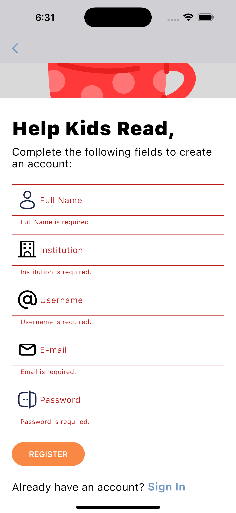
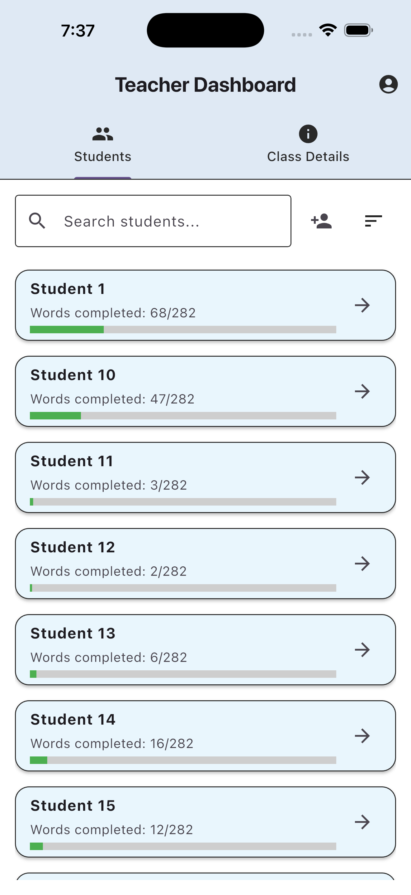
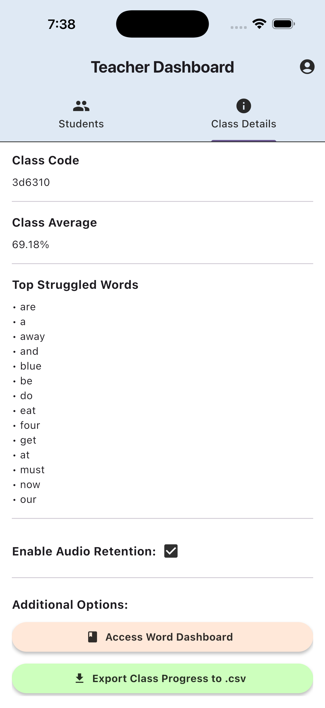
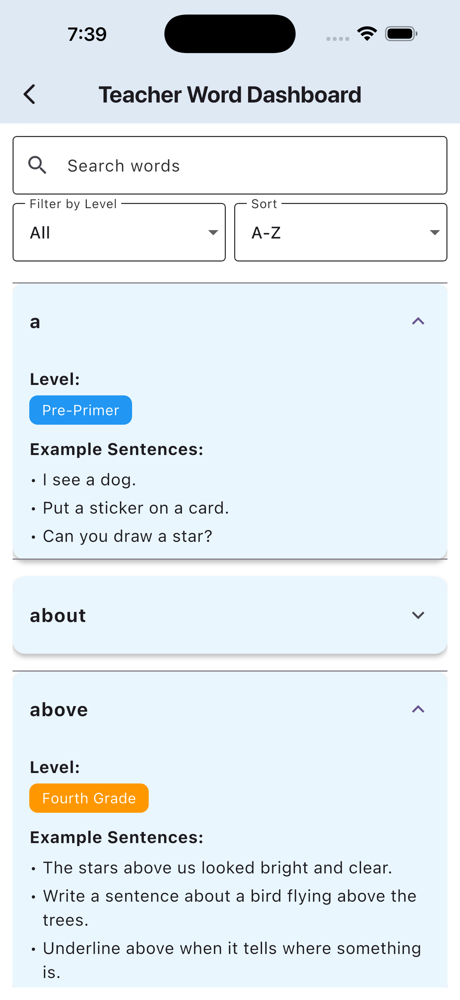
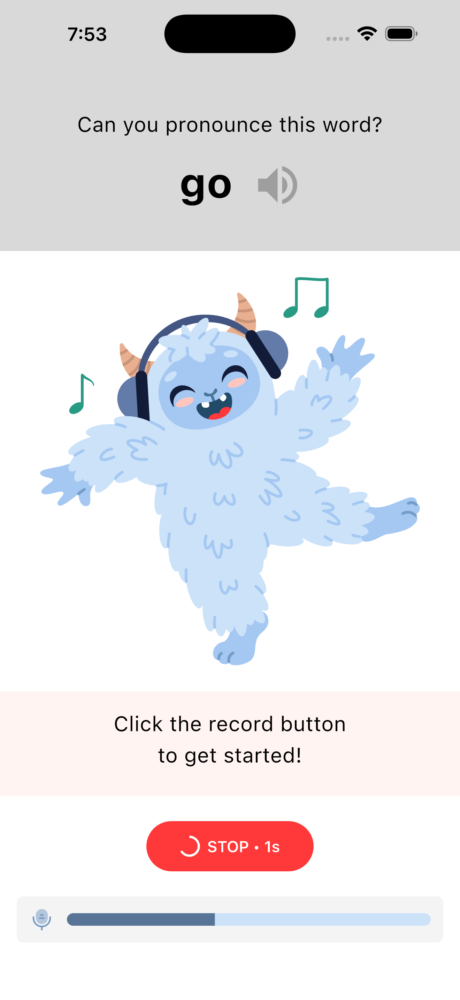
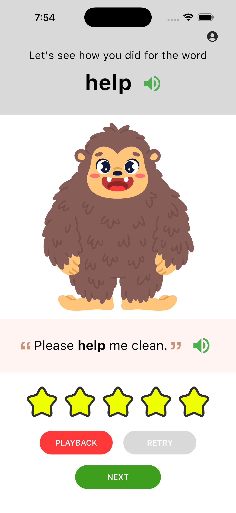
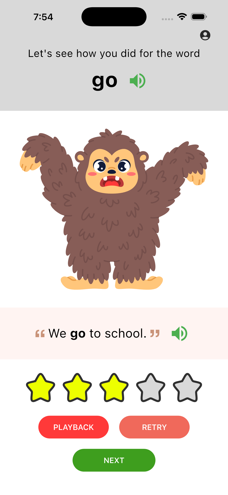

# 📘 ReadRight Prototype  
## Milestone 1 — Foundation & Vertical Slice (MVP)

The **ReadRight** prototype is a dual-role educational platform designed for **teachers** and **students**.  
In its current state, it simulates login, registration, classroom management, and word-pronunciation practice.

> ⚠️ Current functionality began as largely static and non-persistent in Milestone 1.  
> Over Milestone 2, parts of the app have been wired to **Firebase** and real audio/STT services, while keeping the same UX and screen structure described below.

## Milestone 2 — Cloud Scoring + Teacher Tools (Overview)

Milestone 2 builds on this foundation to deliver a full end-to-end practice pipeline:

- **Dolch-aligned curriculum** in `data/seed_words.csv` (Pre-Primer → Fifth Grade) with difficulty ordering.
- A new **audio recording pipeline** (PCM stream, decibel meter, WAV writer, mic permissions).
- **On-device STT** via Picovoice Cheetah plus a **cloud STT path** via Deepgram.
- A **kid-friendly ElevenLabs voice** that reads example sentences on the practice screen.
- A richer **AttemptModel** and Firestore-backed **AttemptRepository** for storing attempts.
- A functional **student word dashboard** using Dolch levels and completion flow.
- A simplified **classCode-based student login** tied to teacher-created classes/students.

The sections below retain the original Milestone 1 descriptions and call out **Milestone 2 updates** where functionality has changed or been extended.

## Milestone 3 — Audio Retention + Analytics + Hardening (Overview)

**.github/workflows/flutter-ci.yml**
  - Github Workflow Action (Continuous Integration/Delivery) is set up to run test suite (e.g. unit, widget, integration) and build out artifacts like Android APK files when committing code to the main branch.
  
**teacher_dashboard_screen.dart**
  - Enhanced Class Details and Progress tracking to have class average, top struggled words, 
  - Enable Audio Retention Option moved to the class level and can now be toggeled
  - Teacher Word Dashboard access has been moved to the Class Details tab
  - Export Class Progess to .csv has been added to Class Details tab and is fully functional

    
**class_student_details_screen.dart**
  - Enhanced to include Student Details & Word Progress tabs
  - Name, Username, Total Average, Top Struggled Word shown on Student Detail Tab
  - List of words that have expandable cards contain word progress, as well as audio playback of the latest attempts
  - Word Progress contains Search, Filter, and Sort

    
**teacher_word_dashboard_screen.dart**
  - UI/UX Enhanced
  - Contains Search, Filter, and Sort
  - List of words that have expandable cards contain word level and word sentence examples

**models/class_model.dart**
  - Handles storing data from the `classes` Firestore collection. 

**models/student_progress_model.dart**
  - Handles storing data from the `student.progress` Firestore collection.

**services/class_repository.dart**
  - Handles CRUD operations from the `classes` Firestore collection. 

**services/student_progress_repository.dart**
  - Handles CRUD operations from the `student.progress` Firestore collection.

**screens/student/student_login_screen.dart**
  - Locked down the student flow by rejecting roles that are not student. This included roles like teacher. This was important to not clutter the word practice average for the class.

**screens/student/word_practice_screen.dart**
  - The RECORD button is disabled while the introduction audio Tts is being played to the student. This prevents cheating should the microphone picking up the audio recording playback after the RECORD button is pressed.
  - After clicking RECORD, the audio playback for the word and word sentence are disabled to prevent cheating should the microphone pickup that audio playback.
  - The RECORD timer is set to 3 seconds (previous 7 seconds)
  - Word practice attempts are saved in the `student.progress` table for use by the teacher.

**screens/student/word_feedback_screen.dart**
  - Audio feedback is played back to the student at start letting them know how they did. Directions on what to do next are presented through audio feedback based on score.
  - The REPLAY, RETRY, and NEXT buttons are disabled while the Tts feedback on page load is being played. This is to avoid an issue with state crashing due to destroy() method.
  - When the student passes the score threshold they are not presented with a RETRY option.
  - The next button is always available should the student want to go on to the next practice word. This prevents the learner from being locked down on a given word should it be hard to pronounce. Difficult words are saved in the database for later retrieval/retry again.

## 🚀 Application Flow
> Please refer to the [Mobile Screens](#mobile-screens) section below to see the actual interface.

### 🏠 Landing Page
A visually engaging startup screen that introduces the ReadRight app before navigating to role selection.

**landing_screen**
> The landing screen serves as an entry, loading screen to the ReadRight app. It serves as a visually appealing startup screen before navigating to the reader_selection_screen.

### 👥 Role Selection
Users identify as either **Teacher** or **Student**, determining which side of the app (portal) they will enter.

**reader_selection_screen**
> The reader selection screen presents a role selection where users identify themselves as either instructors or students. These are the only two operations for this screen, but they carry larger implications as to what side of the app the user will enter, i.e., the instructor portal for instructors or the learning portal for students. 

---

## 👩‍🏫 Teacher Experience

### 🔑 Login / Register / Reset Screens
- **teacher_login_screen.dart** — Teachers sign in with email + password.  
  - “Forgot Password” → Password Reset  
  - “Create Account” → Registration  
  - Mimics Firebase OAuth flow for future functionality.

> This is the Teacher Login screen that allows a teacher to sign into their account using their email and password. The Sign-In button will route to the Teacher Dashboard (given a successful login). If the user cannot remember their password, a forgot password option will be available that will route them to the Password Reset screen. If the user does not have an account, they can select the Create Account link which will direct them to the teacher register screen. These options were created to mimic the functionality that Firebase or other frameworks will provide further in development. This will allow us to have OAuth and provide actual security.

- **teacher_password_reset_screen.dart** — Prototype flow for password recovery via email.

> This screen will serve as the way a teacher can reset their password. Eventually, this will be replaced by a different framework like Firebase but for now this is the prototype to mimic the eventual functionality. The user will provide their email in the input field and submit it to begin the reset process. Once submit is hit, in the future, the user will be able to receive an email to reset the password and the user in the app is directed back to the login screen.

- **teacher_register_screen.dart** — Prototype account creation form; future integration will persist data with Firebase.

> This is where the user will be able to create an account. Again this is temporary and will be replaced by a framework such as Firebase. The user will be prompted to enter a set of information to set up their account. When they are done, they press submit. Once submit is pressed the user account will be created (future functionality) and they will be redirected to the login screen. If the user is at this screen and they already have an account, they may select the Sign in option which will direct them to the Sign in page.

### Update: Milestone 2
- **teacher_register_screen.dart** —  
  When a teacher registers for an account creation, they are prompted to enter in their fullname, institution, username, email, and password. In this milestone, the teacher account registration was enhanced to:
  - Create a **Teacher** document in Firebase.
  - Create a **Class** document and associate it with the teacher.
  - Initialize class progress to empty/0 with no students.
  - Generate a **class code** from the first 6 characters of the Firebase Class document ID (class UID).  
  - Use this class code as the **default password for any students** created in the teacher dashboard and as the primary key for student login.

---

### 🧭 Teacher Dashboard

Acts as the **home base** for teachers.
- Students Tab — list of enrolled students, search + filter, progress overview, click → details
  - Search Students — Type in this field to search for student
  - Person➕ Icon — Add/register a student to the dashboard
  - Sort Icon — Sort by name (A–Z, Z–A) or completion status (High–Low, Low–High)
- Word Dashboard Button — link to the Word Dashboard
- Class Details — Provides an overview of class information/statistics
- Access the Student Details or Word Dashboard

**teacher_dashboard_screen.dart**

> The teacher dashboard is the “Home base” for the teacher app. Here they will be shown the Classes they currently have created. They will be able to add/delete their classes as well as click on each class to go to the Class Dashboard Page. If the user wants to add/modify/remove/view the words in the database for their account, they can select the Go to Word Dashboard button. This screen serves as a way to display or connect the teacher to everything under their account. *Note* Current Data is for display purposes only

#### Update: Milestone 1

This screen is used as the central hub for the teachers so that they may do the following:
- Access the Word Dashboard through the Word Dashboard button
- See all the students registered to their class on the Students Tab
- View a quick completion progress for each student shown through the progress bar under their names.
- Access the `class_student_details_screen` by selecting the student to check on the individual student progress.
- View progress at a class level or extra class details in the Class Details Tab:
  - Teacher
  - Class Code
  - Total Amount of Words Assigned
  - Class Average
  - Top Struggled Words

Currently we are referencing test data that we created from firebase/firestore. This will be updated to match the data with whoever is logged in and their specific class/student information.

### Update: Milestone 2

Added functionality to the following:
- **Search Students:** Type in this field to search for student  
  - The teacher can type out a student's name and the list will filter based on the characters entered.
- **➕ Icon – Add/register a student to the dashboard**
  - Here the teacher can add/register a student to the class:
    - When this button is pressed, a pop-up dialog appears prompting the teacher to add a student.
    - The teacher adds the student's full name, email, and username.
    - Pressing **Create** will:
      - Create a new **Student user**.
      - Create a new **Student profile** where progress is stored (items initialized to empty/0).
      - Add the student to the classroom.
      - Set the student password to the **class code** generated at registration time.
      - Return the teacher to the dashboard and update the student list to include the new student.
    - Pressing **Cancel** returns the teacher to the dashboard without creating a student.
- **Sort Icon – Sort students**  
  - Sort by name (A–Z, Z–A) or completion status (High–Low, Low–High).  
  - The list updates as soon as a sort option is selected.

Over Milestone 2, the dashboard now uses **live Firestore data** for the logged-in teacher’s class instead of purely static test data.

### 🏫 Class Dashboard  (Deprecated)

**class_dashboard_screen.dart**
> The Class Dashboard screen will provide further information about each class concerning the Students enrolled, and the words tied to that class. The Students tab shows a list of the enrolled students and the progress completed with the words tied to the class. This list can be filtered or searched to find the given student. Students can be added or removed from the list and student information can be accessed by clicking the student card. This will route the user to the Class Student Details screen. Under the Words tab, this shows a list of all of the words in the database in a card. The card contains a checkbox which allows the user to select which words they want the class to have access to. Like the Student list it can be filtered. If the user wants to edit the overall database of words, they can be redirected to the Word Dashboard using the + icon. *Note* Current Data is for display purposes only.
>
> #### Update: Milestone 1
> This is being phased out due to time constraints and direction from the customer. Instead of managing multiple classes, the app will just focus on one class per teacher. We can bring this back in a future update if needed. The **Teacher Dashboard** will now be the primary landing page after the teacher logs in successfully.

---

### 👤 Student Details (Teacher View)

- Shows progress, enrollment info, and words the student struggles with.  
- Toggle for **Audio Retention** (simulation only).

**class_student_details_screen.dart** 
> This screen contains further information about the selected student. Here the user can see the progress the student has made along with some additional information such as top words they struggled with, the classes they are enrolled in, etc. The user can also select a checkbox to enable/disable Audio retention. *Note* Current Data is for display purposes only.

#### Update: Milestone 1

This screen is used to display the progress of the given student as well as student options. The screen currently displays the following:
- Progress Bar – showing the amount of words completed out of the given class set
- Student Average
- Total Attempts
- Top Struggled Words
- Option to Toggle Audio Retention

Currently we are referencing test data that we created from firebase/firestore. This will be updated to match the data with whoever is logged in and their specific class/student information.

#### Update: Milestone 2

As attempts are now stored in Firestore (see **Attempt / Recording model** below), the student details view can be backed by real data for:
- Total attempts recorded for that student.
- Word-level struggles derived from the **AttemptModel**.
- Class averages that consider the new scoring pipeline.

---

### 🗂️ Word Dashboard

Teachers can:
- Add new words or CSV files  
- Toggle, edit, delete entries  
- View word details (category + example sentences)  

> Data read from [`data/seed_words.csv`](../../data/seed_words.csv); changes are not saved.

**teacher_word_dashboard_screen**
> This screen contains the full word list available to a teacher. The teacher then has the option to add a new word or CSV file, toggle on or off words, delete words from the list, edit existing words, and view the details of each word, i.e., the word category and example sentences by clicking on the word in the list. *Note* data is read from the default `seed_words.csv` file (`data/seed_words.csv`) and any additions, modifications, or deletions will not be saved at this time. 

#### Update: Milestone 2

The underlying `seed_words.csv` has been expanded to:
- Align with the **Dolch Sight Word lists** (Pre-Primer through Fifth Grade).
- Include a **difficulty ordering** field within each level.
- Provide updated, kid-friendly example sentences used by TTS and practice screens.

Future milestones may move this data into Firestore for fully dynamic word management.

---

## 👩‍🎓 Student Experience

### 🔑 Login & Class Verification
- **student_login_screen.dart** — Students enter their email to receive a class code.  
- **student_passcode_verification_screen.dart** — Students input the 6-digit One-Time Passcode (OTP) code to join their class.

**student_login_screen**
> This screen provides a means for students to access the app and identify their classroom. A simple email text field requires an email through which a class code may be sent, and the student may join a classroom via the `student_passcode_verification_screen`. 

**student_passcode_verification_screen**
> This screen allows students to enter their 6-digit class code they received via email so that they may be added to their classroom and begin learning. An One-Time Passcode (OTP) text field is used to collect the passcode in a visually appealing and PG manner. 

#### Update: Milestone 2

The login flow has been simplified to align with the teacher dashboard and Firestore data:

- Students now primarily log in with a **class code** created when the teacher registers.
- Newly created students (via the Teacher Dashboard) use this class code as their initial password.
- The login + passcode screens are wired to validate against Firestore documents rather than purely simulated OTP values.
- Development-only anonymous flows and test sign-in logic have been removed from `main.dart` to better reflect production behavior.

---

### 📊 Word Dashboard
- **student_word_dashboard_screen.dart**  
  Displays a student’s assigned words and completion progress.  
  - Filter by word type  
  - Click a word to practice  

> *Originally a static example only.*

**student_word_dashboard_screen**
> The student word dashboard screen displays an individual student’s progress for their assigned list of words. Each student may view a personalized dashboard with completed and remaining words, with the ability to filter by word type and/or practice a word by clicking on it. *Note* this is a static example, so filters and progress are simulated. 

#### Update: Milestone 2

The student word dashboard now:

- Organizes words into **Dolch-based levels** (Pre-Primer through Fifth Grade).
- Uses the **difficulty ordering** in `seed_words.csv` to show levels in increasing complexity.
- Can unlock all levels for testing, with future support for locking higher levels until prerequisites are met.
- Drives navigation:
  - From the dashboard to a selected level’s word list.
  - Back from the practice/feedback flow when a level is completed.

---

### 🗣️ Word Practice
- **student_word_practice_screen.dart**  
  Practice pronunciation of selected words with:
  - Word + example sentence  
  - Friendly illustration for engagement  
  - Record + grade attempt (simulated, in Milestone 1)  
  - Recording progress indicator

**student_word_practice_screen**
> This screen allows a student to practice pronouncing whichever word they chose from the `student_word_dashboard_screen`. A friendly illustration is included to make the screen feel friendly and engaging. The word is accompanied by an example sentence, and the student has the ability to record their attempt so it can then be graded. A recording progress indicator is given to notify the user that their attempt is in progress.
> The student's response is then recorded and evaluated against the reference word being practiced. Local and cloud based model selection and assessment appears as follows:

#### Update: Milestone 2 – Audio & STT Pipeline

Milestone 2 replaces the purely simulated recording with a real audio pipeline:

- Uses a **PCM audio stream recorder** (Dart `Stream<Uint8List>`) instead of a stubbed recorder.
- Adds a **decibel meter** that animates while the student is speaking.
- Requests **microphone permission** on first use of the practice screen.
- Writes recordings in **WAV format**, with codec and duration information stored in the attempt model.
- Removes earlier FFmpeg-based conversion logic in favor of a simpler PCM → WAV writer.

For assessment:

- A new **on-device CheetahAssessor** implements a common `PronunciationAssessor` interface.
- STT assessment now runs **after recording stops**, simplifying the user experience and internal state.
- Results are normalized into an `AssessmentResult` object (score, transcript, confidence) that is passed into the feedback screen.
- **Deepgram** acts as a **cloud fallback** STT provider where on-device models are not available or network conditions favor cloud.

Example flow:
1. ElevenLabs reads the example sentence to the student.
2. Student records an attempt.
3. Cheetah (or Deepgram) transcribes and scores the attempt.
4. The score is converted to a **star rating** on the feedback screen.
5. An **AttemptModel** document is written to Firestore for analytics and future review.

---

### 🧮 Analysis Method Selection

When selecting a method to analyze the heard transcript using a speech-to-text (STT) service, it was necessary to consider both the string similarity between the spoken transcript and the target reference text, as well as the phonetic pattern between these two variables.

#### 🔤 String Similarity

The Jaro–Winkler distance and Levenshtein distance were primarily considered:

- **Levenshtein Distance** — counts the number of additions and deletions between two different strings.
- **Jaro–Winkler Distance** — assigns a similarity score between two strings and handles transposed characters more gracefully. It also computes matched characters and transpositions more efficiently than full Levenshtein for short strings due to its localized matching logic.

> Based on these characteristics, the Jaro–Winkler algorithm was selected for implementation.

- [Jaro–Winkler Distance](https://en.wikipedia.org/wiki/Jaro%E2%80%93Winkler_distance)  
- [Levenshtein Distance](https://en.wikipedia.org/wiki/Levenshtein_distance)

#### 🔊 Phonetic Pattern Comparison

Phonemizer and CMUdict were evaluated:

- **Phonemizer** — converts text into phonemes using rule-based, statistical, or neural model backends. It is multilingual and handles out-of-vocabulary items gracefully.
- **CMUdict** — uses a manually curated pronunciation dictionary for American English. It provides fast lookups via Dart maps and predictable behavior.

> Given that valid English words are expected from the STT provider, CMUdict was selected for implementation.

- [Phonemizer](https://bootphon.github.io/phonemizer/)  
- [CMUdict](https://en.wikipedia.org/wiki/CMU_Pronouncing_Dictionary)

---

### 🧠 Local Analysis Method Implementation

This method computes a similarity score between a spoken transcript and a reference word.

- Transcript is retrieved via **Deepgram API**, with **Cheetah** as fallback.
- Transcript is normalized to lowercase and stripped of punctuation.
- Each word in the transcript is scored against the target word.

> Example: If the target is `"run"` and the transcript is `"do not run in the house"`, `"run"` is correctly identified.

#### Scoring Flow

1. **Jaro–Winkler** runs first and returns a score between 0 and 1.
2. If no exact match is found, **CMUdict** converts each word to phonemes.
3. A custom **Levenshtein** implementation compares phoneme lists.
4. Scores are computed and returned via an `AssessmentResult` object.

> This result is passed to the feedback screen where star ratings are adjusted accordingly.

**Note:** The local method and assessment currently lack a mechanism to determine transcript or assessment confidence. Confidence surfaces from some providers (like Deepgram) are stored on the attempt for future use but do not yet influence the score.

---

### ☁️ Cloud STT Model Selection

Latency and accuracy were prioritized when selecting a cloud-based STT model. The following models were evaluated:

- **Whisper (OpenAI)** — high accuracy under varied conditions, but latency issues on mobile devices.
- **AssemblyAI** — low latency and rich metadata, but optimized for clean speech.
- **Deepgram Nova-3** — best balance of latency and accuracy under varied conditions.

> Deepgram was selected for its performance and modern architecture.

#### Model Links

- [Whisper (OpenAI)](https://openai.com/index/whisper/)  
- [Google Cloud STT](https://cloud.google.com/speech-to-text?hl=en)  
- [AssemblyAI](https://www.assemblyai.com/)  
- [Microsoft Azure STT](https://azure.microsoft.com/en-us/pricing/purchase-options/azure-account/search?icid=ai-services)  
- [Speechace](https://www.speechace.com/)  
- [Deepgram Nova-3](https://deepgram.com/learn/introducing-nova-3-speech-to-text-api)

---

### 🔁 Cloud STT Model Implementation

Since Deepgram does not include its own comparison method, the local comparison operation is reused.

> This approach can be expanded to support cloud-based models for directly comparing strings or audio files.

**Note:** Confidence scores can be extracted from Deepgram’s API response, but currently do not influence scoring.

---

## 🧾 Data Source: [`data/seed_words.csv`](../../data/seed_words.csv)

A structured word list for early reading and pronunciation practice. Words are categorized according to popular word lists (e.g., Dolch, Phonics, Minimal Pairs).

| Word | Category | LevelOrder | Sentence 1 | Sentence 2 | Sentence 3 |
|------|-----------|-----------|------------|------------|------------|
| away | Dolch Pre-Primer | 3 | The puppy ran away. | Put your toys away now. | Birds fly away in winter. |
| does  | Dolch Second Grade | 11 | He does his homework every day. | What does this word mean? | She never does her chores late. |

#### Update: Milestone 2

- Expanded to cover the **full Dolch Sight Word sets** from Pre-Primer through Fifth Grade.
- Added a **level** field and a **difficulty ordering** index used for student progression.
- Updated example sentences for clarity and age-appropriate content.
- Used by both the **Teacher Word Dashboard** and **Student Word Dashboard** as a single source of truth.

---

## 🔥 Firebase Integration

This prototype was developed with future Firebase integration in mind. The codebase includes scaffolding and utilities for the following Firebase services:

- Authentication (email/password, anonymous for dev)
- Cloud Firestore (attempts, classes, student_progress, users, words)
- Cloud Functions (server-side helpers and callable functions)
- Firebase Storage (assets and recordings — planned)

Developer notes:

- Platform configuration (iOS/Android) is expected under `ios/Runner/` and `android/` (e.g. `GoogleService-Info.plist` / `google-services.json`). The project also contains a generated `firebase_options.dart` when Firebase CLI configuration is complete.
- For local development and tests we use the Firebase Emulator Suite or mock libraries (`fake_cloud_firestore`, `firebase_auth_mocks`) so CI and unit tests don't require live Firebase resources.
- If you need to mint custom auth tokens or perform privileged admin tasks, do that from a trusted backend (Cloud Functions / server) using the Admin SDK — never embed service account credentials in the client.

See the code under `lib/utils/` and `lib/services/` for repository helpers and metadata handling used for Firestore writes.

#### Update: Milestone 2

Milestone 2 moves several flows from “prototype only” toward real Firebase-backed implementations:

- Teacher registration now **creates Class documents** with generated class codes.
- Student creation from the Teacher Dashboard writes **Student** and **Student progress** documents.
- Attempts from the practice screen are persisted using the new **AttemptModel** under a `student.progress` collection.
- The student login flow (classCode) validates credentials against Firestore instead of purely simulated data.

---

## lib/models — Summary & work completed

- **User / Auth models (`user_model.dart`)**
  - Represents authenticated users with id, email, displayName and role (teacher/student).
  - JSON (de)serialization, simple validation, and convenience getters implemented.
  - Designed to be compatible with Firebase Auth user metadata and mock providers.

- **Teacher model (`teacher_model.dart`)**
  - Encodes teacher-specific fields: teacherId, name, primaryClassId, settings.
  - Includes helper methods for shallow updates and mapping to Firestore documents.

- **Student model (`student_model.dart`)**
  - Encapsulates student profile, enrolled class code(s), and summary progress metrics.
  - Supports copyWith and JSON mapping for persistence and UI binding.

- **Class model (`class_model.dart`)**
  - Represents a classroom: id, name, teacherId, classCode, list of studentIds and wordIds.
  - Includes derived properties (totalWords, classAverage) and simple helpers for membership changes.

- **Word model (`word_model.dart`)**
  - Stores word text, category, example sentences, enabled flag, and optional audio asset path.
  - Implements serialization and small utilities used by UI filters.

- **Attempt / Recording model (`attempt_model.dart`)**
  - Models a student attempt: id, studentId, wordId, timestamp, score, audioUrl/path.
  - Used by the simulated grading flow and for storing attempt history.

- **Progress / Stats models (`progress_model.dart`)**
  - Aggregates per-student and per-class progress metrics (completed count, averages, top struggles).
  - Lightweight DTOs to feed the dashboard and student detail screens.

- **Enums and helpers (`word_category.dart`, `role.dart`)**
  - Shared enums for roles and word categories and simple mappers to/from strings.

General work completed in models:
- Defined canonical domain types for the app to keep UI and services consistent.
- Added JSON serialization, equality, and copyWith patterns to simplify testing and state updates.
- Kept models small and Firestore-friendly (flat maps / primitive values) to ease future persistence changes.

#### Update: Milestone 2 – AttemptModel & Related Models

- **AttemptModel** was extended to include:
  - `classId`, `audioCodec`, `durationMS`, `confidence`, `devicePlatform`, `deviceOS`.
  - A deterministic `id` based on `(classId, userId, wordId, audioPath)` to avoid collisions on repeated attempts.
- **Student progress** documents were consolidated under a `student.progress` collection to better reflect the role of attempts and progress as analytics data rather than core roster information.

---

## lib/services — Summary & work completed

- **AuthService (`auth_service.dart`)**
  - Abstracts sign-in, register, signOut, and password reset flows.
  - Implementations include Firebase-backed and a development/mock variant for local testing.
  - Exposes currentUser stream and convenience methods used by the login screens.

- **FirestoreService / DatabaseService (`firestore_service.dart`)**
  - Generic CRUD wrappers for Firestore collections/documents with typed mappers.
  - Provides batched writes and transaction helpers where needed by classroom/word operations.
  - Includes emulator-friendly configuration guards and error mapping.

- **UserService (`user_service.dart`)**
  - Higher-level user profile reads/writes: fetch profile, update displayName, toggle preferences.
  - Coordinates with AuthService for syncing auth metadata and persisted user docs.

- **ClassService (`class_service.dart`)**
  - Create/join class, generate/verify class codes, add/remove students, and assign words to a class.
  - Implements the single-class-per-teacher simplification used by Milestone 1.
  - Returns domain models and progress summaries for dashboards.

- **WordService (`word_service.dart`)**
  - Loads words from seed CSV and provides CRUD operations (add/edit/toggle/delete) — changes currently non-persistent in Milestone 1.
  - Filtering and category helpers consumed by teacher and student dashboards.
  - CSV import helper implemented to parse `seed_words.csv` for initial data.

- **AttemptService / GradingService (`attempt_service.dart`)**
  - Stores simulated attempts, computes a graded score (mocked), and returns feedback (happy/sad).
  - Provides recording lifecycle hooks: startRecording, stopRecording, uploadRecording (simulated or via StorageService).

- **StorageService (`storage_service.dart`)**
  - Abstract for asset and recording uploads/downloads.
  - Firebase Storage implementation is scaffolded; a local/mock variant is used for dev and CI.

- **Passcode / EmailService (`passcode_service.dart` / `email_service.dart`)**
  - Simulates sending a 6-digit OTP/class code to student emails and verifies codes during join flow.
  - Designed so real email providers or Cloud Functions can be swapped in later.

- **Utilities & Helpers (`csv_loader.dart`, `json_helpers.dart`, `firebase_helpers.dart`)**
  - Utilities for CSV parsing of seed data, model <-> map conversions, and Firebase initialization helpers (including `firebase_options`).
  - Error handling and logging helpers used across services.

General work completed in services:
- Built a thin service layer separating UI from persistence, with interfaces for easy mocking in tests.
- Implemented both Firebase-backed and mock/dev implementations so the prototype can run with or without the Firebase Emulator Suite.
- Implemented seed-data loading and simulated flows (grading, OTP email) to enable end-to-end UI demos without persistent backends.
- Focused on async APIs (Futures/Streams) and minimal error mapping so screens can react to loading and error states.

#### Update: Milestone 2 – Audio, STT & Attempts

- Introduced a **PronunciationAssessor** abstraction with:
  - On-device implementation (`CheetahAssessor`).
  - Cloud implementation wired to Deepgram.
- Extended the attempt-writing flow to:
  - Use the richer `AttemptModel`.
  - Persist transcripts, confidence, and normalized scores.
- Audio services were updated to:
  - Use PCM streaming and WAV writing.
  - Remove FFmpeg-based conversion paths.

Notes for future work:
- Replace remaining simulated grading and email/passcode flows with real Cloud Functions or ML models and an email provider.
- Wire model serialization strictly to Firestore security rules and add server-side validation.
- Add more robust offline handling and persistence (offline queue) for teacher edits and student attempts.

---

## 👩‍💻 Contributors
| Name | Email |
|------|--------|
| **Zachary Trabookis** | <ztraboo@clemson.edu> |
| **Jonathan Gilreath** | <jhgilre@g.clemson.edu> |
| **Noah Carter** | <ncarte4@clemson.edu> |

---

## 📱 Mobile Screens

## Launch Application Icon
Changed the application icon to match theme of the screens and have greater visibiility:

| Launch Icon |
|:--:|
|  |

### Landing and Onboarding
The following screens showcase the onboarding steps for the application:

| Landing | Role Selection |
|:--:|:--:|
|  |  |

### Persistence Login
The following screens showcase the persistence login for a student (e.g. Emma Collins) within the application:

| Student Flow Persistence (Success) | Teacher Flow Persistence (Failure) |
|:--:|:--:|
|  |  |

### Teacher Flow
The following screens showcase teacher interfaces for the application:

| Login | Registration |
|:--:|:--:|
|  |  |

<!-- | Class Dashboard | Class Progress | Class Word List |
|:--:|:--:|:--:|
|  |  |  | -->

| Teacher Dashboard (Student Progress) | Teacher Dashboard (Class Details) |
|:--:|:--:|
|  |  |

| Student Details | Word Dashboard (Edit) |
|:--:|:--:|
|  |  |

### Student Flow
The following screens showcase student interfaces for the application:

| Login | Password Verification |
|:--:|:--:|
|  |  |

| Word Practice List | Word Practice | 
|:--:|:--:|
|  |  |

| Word Feedback (Happy) | Word Feedback (Sad) |
|:--:|:--:|
|  |  |

---

© 2025 ReadRight Team — Clemson University - CPSC 6150
